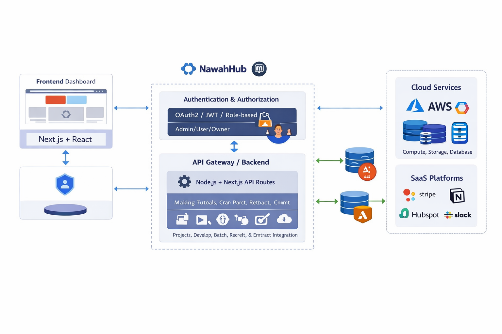

# NawahHub

NawahHub is a digital platform hub designed to provide users with access to cloud services, SaaS solutions, and project management tools. It acts as a centralized gateway where users can manage their projects, connect to external services, and interact with digital infrastructure in a secure and consistent way.

---

## Features

- **Project Management** – Users can create, manage, and monitor projects directly from the platform.
- **Connectors** – Integration with external services, APIs, and cloud solutions.
- **Authentication & Security** – Secure login, session management, and data handling.
- **Static Frontend** – Fast and responsive interface for seamless user experience.
- **Extensible Architecture** – Modular structure for future services and integrations.

---

## High-Level Architecture

This diagram shows the high-level architecture of NawahHub, illustrating how the platform connects users to digital services, cloud infrastructure, and SaaS solutions.



**Key Components:**

1. **Authentication (`/api/auth`)** – Handles secure user login and session management.
2. **Projects (`/api/projects`)** – Allows users to create and manage their projects on the platform.
3. **Connectors (`/api/connectors`)** – Interfaces to connect user projects with external services, APIs, and cloud platforms.
4. **Frontend (`pages/`)** – Provides a static and responsive interface for users to access services and dashboards.
5. **Library (`lib/`)** – Contains shared utilities, database connectors, and helper functions.
6. **Public (`public/`)** – Stores static assets, images, and files accessible by the front-end.

> NawahHub acts as a centralized hub for digital projects, enabling users to integrate multiple services while providing a consistent and secure interface.

---

Project Structure

/architecture # Architecture diagrams and visuals
/components # React components or UI elements
/pages # Frontend pages and routes
/pages/api/auth # Authentication APIs
/pages/api/projects # Project management APIs
/pages/api/connectors # External service connectors
/lib # Libraries and helper utilities
/public # Static assets like images, files, etc


---

## Getting Started

1. Clone the repository:
```bash
git clone git@github.com:nawahtkui/nawahub.git
cd nawahub


Install dependencies:

npm install

Run the development server:

npm run dev


Build for production:

npm run build


Contributing 

Fork the repository and create a new branch for your feature.

Make your changes and test them locally.

Submit a pull request describing your changes.


License
MIT License


